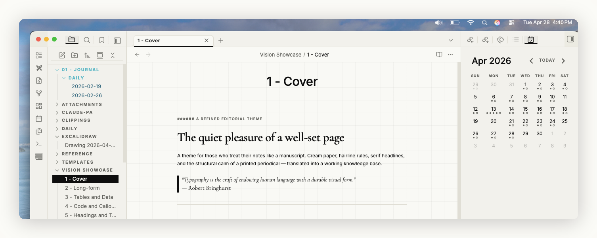
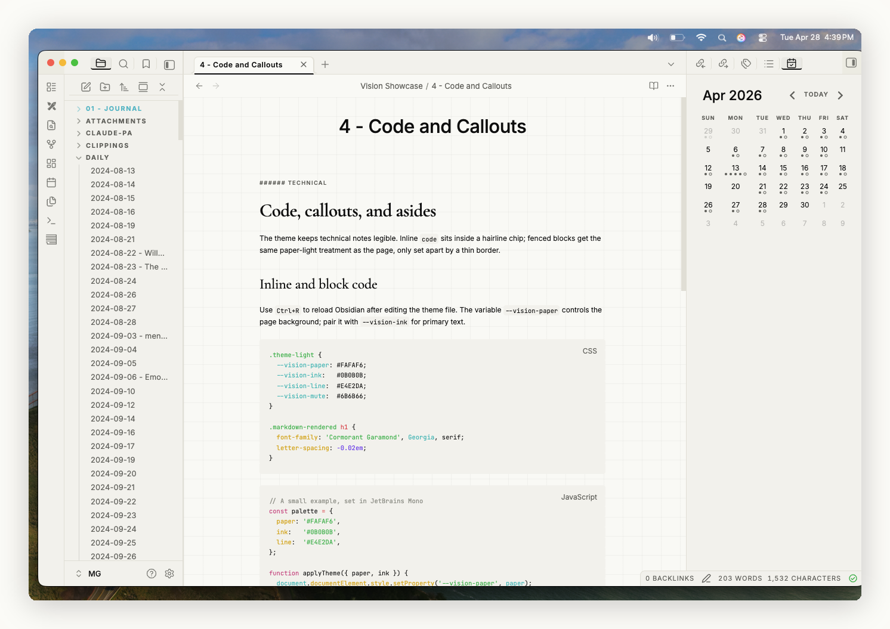
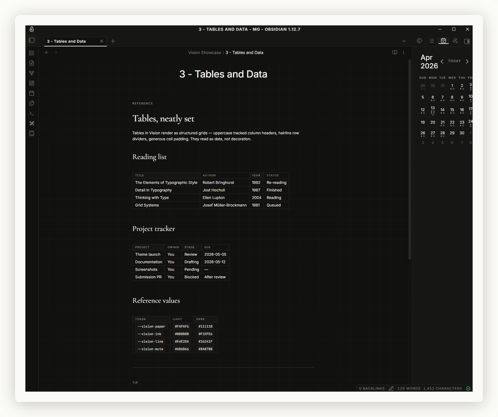
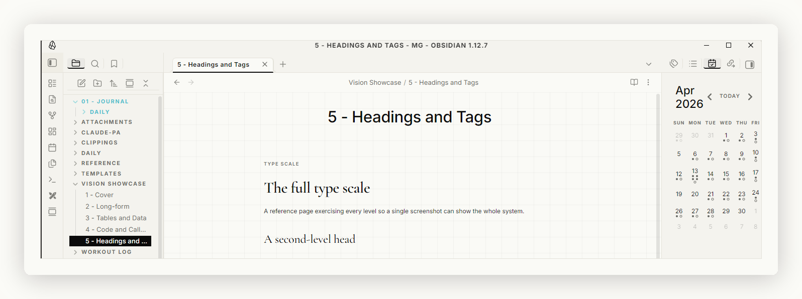
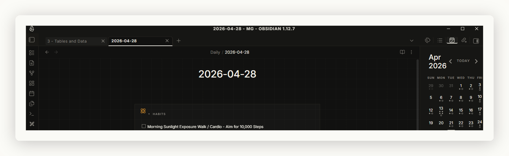

# Vision

A refined editorial theme for [Obsidian](https://obsidian.md). Cream paper with a subtle grid, elegant serif headings, crisp ink accents — built to make notes feel like a structured manuscript rather than a scratchpad.

## About Vision

- [Screenshots](#screenshots)
- [Installation](#installation)
- [Features](#features)
- [Typography](#typography)
- [Customization](#customization)
- [Contributing](#contributing)
- [License](#license)

## Screenshots



**Code and callouts** stay legible without disrupting the page.



**Tables render as structured grids** — uppercase tracked column headers, hairline row dividers.



**The full type scale**, H1 through H6, exercising headings, body, and inline elements.



**Companion dark mode** — ink-on-paper inverted.



## Installation

### From the Obsidian community gallery

> _Pending submission. Once accepted:_
>
> 1. Open Obsidian → **Settings → Appearance**
> 2. Under **Themes**, click **Manage** and search for "Vision"
> 3. Click **Use**

### Manual install

1. Download `manifest.json` and `theme.css` from the [latest release](../../releases)
2. Place them in `<your-vault>/.obsidian/themes/Vision/`
3. Open Obsidian → **Settings → Appearance** → select **Vision**

### Via git (for contributors)

```bash
git clone https://github.com/Mukhil-G/obsidian-vision.git "<your-vault>/.obsidian/themes/Vision"
```

## Features

- **Light and dark variants** — cream paper for light, ink-on-paper inverted for dark
- **Subtle 32px grid background** — gridded-paper texture without distracting from text
- **Editorial typography** — Cormorant Garamond serif for H1–H3, Inter sans for body
- **Eyebrow labels** — H4–H6 render as uppercase, tracked-out small caps
- **Pull-quote blockquotes** — italic serif, indented with a hairline rule
- **Structured tables** — uppercase tracked column headers, hairline row borders
- **Section-divider rules** — horizontal rules render with a centered `§` glyph
- **Outlined tag chips** — squared, uppercase, monospace tracking
- **Pure-ink CTAs** — squared 2px corners, no rounded buttons

## Typography

| Use            | Font                | Source         |
| -------------- | ------------------- | -------------- |
| Headings (H1–H3) | Cormorant Garamond | Google Fonts   |
| Body           | Inter               | Google Fonts   |
| Code           | JetBrains Mono      | Google Fonts   |

Fonts load from Google Fonts at runtime. Internet required on first load; cached after that. Replace the `@import` line at the top of `theme.css` to self-host or swap fonts.

## Customization

The theme exposes its core palette as CSS variables prefixed with `--vision-`. Override them in a CSS snippet (Settings → Appearance → CSS Snippets) to retune without forking:

```css
.theme-light {
  --vision-paper:  #FAFAF6;   /* page background */
  --vision-ink:    #0B0B0B;   /* primary text + accents */
  --vision-line:   #E4E2DA;   /* hairline borders */
  --vision-mute:   #6B6B66;   /* muted text */
}
```

Want a different accent color, a wider reading column, or no grid? Open an issue with what you'd like.

## Contributing

Pull requests welcome. The theme is a single `theme.css` — no build step.

1. Fork and clone into your vault's themes folder
2. Make changes; reload Obsidian (`Ctrl+R`) to see them
3. Bump `manifest.json` version (semver) before opening a PR

## License

[MIT](LICENSE) © 2026 Mukhil-G
